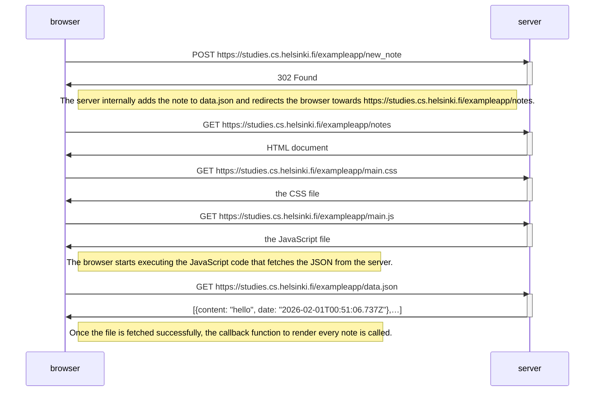

```mermaid
    sequenceDiagram
        participant browser
        participant server

        browser->>server: POST https://studies.cs.helsinki.fi/exampleapp/new_note
        activate server
        server->>browser: 302 Found
        deactivate server

        Note right of browser: The server internally adds the note to data.json and redirects the browser towards https://studies.cs.helsinki.fi/exampleapp/notes.

        browser->>server: GET https://studies.cs.helsinki.fi/exampleapp/notes
        activate server
        server->>browser: HTML document
        deactivate server

        browser->>server: GET https://studies.cs.helsinki.fi/exampleapp/main.css
        activate server
        server->>browser: the CSS file
        deactivate server

        browser->>server: GET https://studies.cs.helsinki.fi/exampleapp/main.js
        activate server
        server->>browser: the JavaScript file
        deactivate server

        Note right of browser: The browser starts executing the JavaScript code that fetches the JSON from the server.

        browser->>server: GET https://studies.cs.helsinki.fi/exampleapp/data.json
        activate server
        server->>browser: [{content: "hello", date: "2026-02-01T00:51:06.737Z"},…]
        deactivate server

        Note right of browser: Once the file is fetched successfully, the callback function to render every note is called.
```