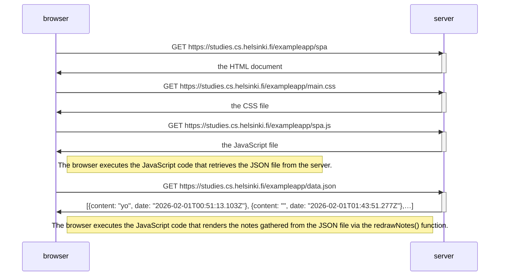

```mermaid
    sequenceDiagram
        participant browser
        participant server

        browser->>server: GET https://studies.cs.helsinki.fi/exampleapp/spa
        activate server
        server->>browser: the HTML document
        deactivate server

        browser->>server: GET https://studies.cs.helsinki.fi/exampleapp/main.css
        activate server
        server->>browser: the CSS file
        deactivate server

        browser->>server: GET https://studies.cs.helsinki.fi/exampleapp/spa.js
        activate server
        server->>browser: the JavaScript file
        deactivate server

        Note right of browser: The browser executes the JavaScript code that retrieves the JSON file from the server.

        browser->>server: GET https://studies.cs.helsinki.fi/exampleapp/data.json
        activate server
        server->>browser: [{content: "yo", date: "2026-02-01T00:51:13.103Z"}, {content: "", date: "2026-02-01T01:43:51.277Z"},…]
        deactivate server

        Note right of browser: The browser executes the JavaScript code that renders the notes gathered from the JSON file via the redrawNotes() function.
```